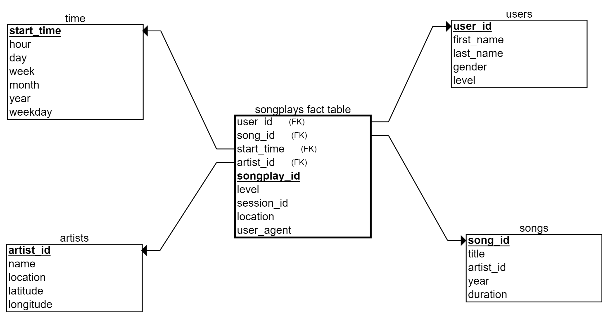

# Data Warehousing with Amazon Redshift

# Introduction

A music streaming startup, Sparkify, has grown their user base and song database and want to move their processes and data onto the cloud. Their data resides in S3, in a directory of JSON logs on user activity on the app, as well as a directory with JSON metadata on the songs in their app.

# Project Description

i will an ETL pipeline that extracts their data from S3, stages them in Redshift, and transforms data into a set of dimensional tables for their analytics team to continue finding insights into what songs their users are listening to.

## Project Datasets

i'll be working with 3 datasets that reside in S3. Here are the S3 links for each:

- **Song data**: s3://udacity-dend/song_data
- **Log data**: s3://udacity-dend/log_data
- **This third file**: s3://udacity-dend/log_json_path.jsoncontains the meta information that is required by AWS to correctly load s3://udacity-dend/log_data
## Schema for Song Play Analysis
For Sparkify database i designed a star schema which consist of one fact table (songplays), and  four dimensional tables (songs, artists, users and time).

### The database star schema
 

#### Fact Table
1. **songplays** - records in log data associated with song plays i.e. records with page NextSong
  
  - songplay_id, start_time, user_id, level, song_id, artist_id, session_id, location, user_agent

#### Dimension Tables
1. **users** - users in the app

 - user_id, first_name, last_name, gender, level

2. **songs** - songs in music database

 - song_id, title, artist_id, year, duration

3.	**artists** - artists in music database

 - artist_id, name, location, latitude, longitude

4.	**time** - timestamps of records in songplays broken down into specific units
    
 - start_time, hour, day, week, month, year, weekday

## Files in the repository
The project template includes four files:

- **create_table.py** is where i'll create the fact and dimension tables for the star schema in Redshift.
- **etl.py** is where i'll load data from S3 into staging tables on Redshift and then process that data into the analytics tables on Redshift.
- **sql_queries.py** is where i'll define  SQL statements, which will be imported into the two other files above.
- **IaC.ipynb** is where i'll create a cluster, iam role and delete them, Query data
- **Run.ipynb** is where i'll create_tables.py, etl.py scripts
- **README.md** is where i'll provide discussion on your process and decisions for this ETL pipeline.
